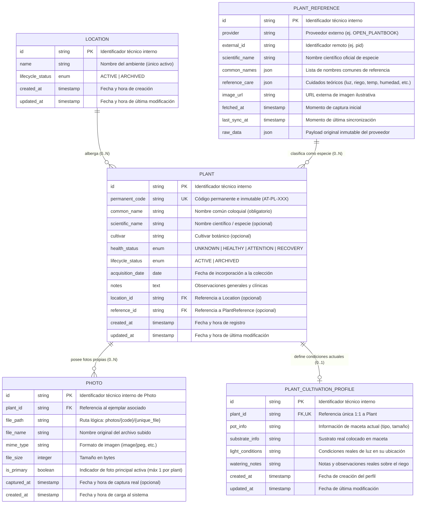

# Modelo de Datos Lógico — Atilio Plants v0.1

Este documento establece el diseño conceptual y lógico del modelo de datos para **Atilio Plants v0.1 (MVP)**, garantizando el cumplimiento estricto de los principios rectores del producto, la soberanía local-first, la integridad referencial y la integración con referencias botánicas externas.

---

## 1. Principios del Modelo de Datos

1. **Ejemplar físico único:** La entidad central representa un espécimen botánico biológico individual (`Plant`).
2. **Inmutabilidad y unicidad de clave permanente:** El código de inventario `AT-PL-XXX` es inmutable, estrictamente único y nunca reutilizable (incluso tras el archivado del ejemplar).
3. **Desacoplamiento entre ID técnico y código de negocio:** El modelo convive con un identificador técnico interno subyacente (ej. UUID) para integridad referencial estable y un identificador permanente visible de negocio (`AT-PL-XXX`) para etiquetado, indexación y visualización del usuario.
4. **Archivado lógico (*soft delete*):** No existe eliminación destructiva en el dominio. Tanto plantas como ubicaciones manejan estados de ciclo de vida explícitos.
5. **Separación estricta de estados:** El ciclo de vida (`lifecycle_status`) y el estado sanitario (`health_status`) son conceptos ortogonales y disjuntos.
6. **Ubicaciones administrables de catálogo:** Las ubicaciones son entidades con ciclo de vida propio. El archivado de una ubicación no destruye ni altera las plantas históricamente asociadas a ella, pero impide nuevas asignaciones.
7. **Preservación inmutable de fotografías:** Las fotos reemplazadas no se destruyen en disco ni en el modelo lógico; la entidad `Photo` permite múltiples registros cronológicos vinculados a una planta, distinguiendo la foto principal mediante el atributo `is_primary`. La entidad `Plant` **no** almacena un `primary_photo_id`.
8. **Estructura de almacenamiento de fotos:** Organización física jerárquica por subdirectorios basados en el código permanente (`photos/{permanent_code}/<unique-file-id>.<ext>`), con nombres físicamente únicos compatibles con object storage.
9. **Desacoplamiento de Referencia Botánica Externa (`PlantReference`):** Se separa el ejemplar físico de la información botánica y de cuidados teóricos provistos por Open Plantbook. Una planta puede o no estar vinculada a una referencia externa (`reference_id = null`). Múltiples ejemplares pueden compartir la misma referencia de especie.
10. **Condiciones Reales de Cultivo Actual (`PlantCultivationProfile`):** Aísla exclusivamente *"cómo está cultivado hoy este ejemplar"* (`pot_info`, `substrate_info`, `light_conditions`, `watering_notes`), sin confundirlo con los requerimientos generales de la especie (*Reference Care*).
11. **Fidelidad del dato (tolerancia a desconocimiento):** Todo atributo botánico o de cultivo no contrastado admite explícitamente valores nulos (`null` / `unknown`).
12. **Desacoplamiento de telemetría y Home Assistant:** Los sensores e integraciones IoT no forman parte del núcleo relacional de v0.1.

---

## 2. Diagrama Entidad-Relación Conceptual (Mermaid ERD)



---

## 3. Entidades del Dominio

### 3.1. Entidad: `Plant`
- **Propósito:** Representa el ejemplar físico individual e inmutable en el centro del sistema.
- **Atributos:**
  - `id`: Identificador técnico interno primario.
  - `permanent_code`: Código visible oficial `AT-PL-XXX`. Restricción: Único e inmutable.
  - `common_name`: Nombre común asignado (único campo de texto obligatorio a cargo del usuario en alta).
  - `scientific_name`: Nombre de la especie botánica (opcional, nullable).
  - `cultivar`: Cultivar o variedad botánica (opcional, nullable).
  - `health_status`: Estado de salud (`UNKNOWN`, `HEALTHY`, `ATTENTION`, `RECOVERY`). Default: `UNKNOWN`.
  - `lifecycle_status`: Estado del registro (`ACTIVE`, `ARCHIVED`). Default: `ACTIVE`.
  - `acquisition_date`: Fecha en que el ejemplar se incorporó físicamente a la colección. Default: fecha actual.
  - `notes`: Observaciones y anotaciones clínicas (opcional, nullable).
  - `location_id`: Clave foránea referenciando a `Location` (opcional, nullable).
  - `reference_id`: Clave foránea referenciando a `PlantReference` (opcional, nullable).
  - `created_at`: Timestamp de auditoría de creación. Inmutable.
  - `updated_at`: Timestamp de auditoría de última modificación. Actualizado en cada guardado.
- **Restricciones:**
  - `permanent_code` UNIQUE en toda la tabla (incluyendo registros archivados).
  - `common_name` NOT NULL y longitud no vacía.
  - `health_status` NOT NULL con valores restringidos al dominio definido.
  - `lifecycle_status` NOT NULL (`ACTIVE` / `ARCHIVED`).
  - La entidad `Plant` **no** almacena una columna `primary_photo_id`; la foto principal se resuelve a través de `Photo.is_primary`.

### 3.2. Entidad: `PlantReference`
- **Propósito:** Almacena el conocimiento botánico compartido y los cuidados teóricos de una especie/taxón provenientes de fuentes externas (Open Plantbook), desacoplado de la identidad de cada ejemplar físico.
- **Atributos:**
  - `id`: Identificador técnico interno primario.
  - `provider`: Nombre del proveedor externo (ej. `OPEN_PLANTBOOK`).
  - `external_id`: Identificador nativo en la base externa (ej. `pid`).
  - `scientific_name`: Nombre científico de la especie según el catálogo externo.
  - `common_names`: Nombres comunes sugeridos por el catálogo.
  - `reference_care`: Objeto estructurado que agrupa los cuidados teóricos de la especie:
    - Umbrales ambientales: temperatura (`min_temp`, `max_temp`), luz en lux (`min_light_lux`, `max_light_lux`), humedad de suelo (`min_soil_moist`, `max_soil_moist`), conductividad (`min_soil_ec`, `max_soil_ec`), humedad ambiental (`min_env_humid`, `max_env_humid`).
    - Cuidados cualitativos: `watering`, `sunlight`, `soil`, `pruning`, `fertilization`.
  - `image_url`: URL de la fotografía ilustrativa de catálogo del proveedor.
  - `fetched_at`: Timestamp de la obtención inicial del registro.
  - `last_sync_at`: Timestamp de la última sincronización/verificación.
  - `raw_data`: Snapshot íntegro del payload JSON devuelto por la API externa.
- **Restricciones y Reglas:**
  - Clave lógica compuesta única: `UNIQUE(provider, external_id)`.
  - Inmutabilidad local: El snapshot persiste localmente y nunca se destruye automáticamente por fallos o bajas en el servidor externo.
  - Múltiples `Plant` pueden compartir la misma `PlantReference`.
  - `image_url` es de carácter puramente ilustrativo de especie y no reemplaza a `Photo`.

### 3.3. Entidad: `Location`
- **Propósito:** Catálogo administrable de espacios físicos / ambientes donde conviven las plantas.
- **Atributos:**
  - `id`: Identificador técnico interno primario.
  - `name`: Nombre descriptivo del ambiente (ej. "Living", "Cocina", "Escritorio").
  - `lifecycle_status`: Estado en el catálogo (`ACTIVE`, `ARCHIVED`). Default: `ACTIVE`.
  - `created_at`: Timestamp de creación.
  - `updated_at`: Timestamp de última modificación.
- **Restricciones y Reglas:**
  - `name` único entre las ubicaciones con estado `ACTIVE`.
  - Al archivar una ubicación, las plantas asociadas preservan su `location_id` histórico intacto, pero el ambiente no se ofrece para nuevas asignaciones.

### 3.4. Entidad: `Photo`
- **Propósito:** Registro y metadata de cada imagen fotográfica capturada del ejemplar físico, garantizando la preservación en disco de las fotografías reemplazadas.
- **Atributos:**
  - `id`: Identificador técnico interno primario de la foto.
  - `plant_id`: Clave foránea vinculante a `Plant`.
  - `file_path`: Storage key o ruta lógica del archivo (`photos/{permanent_code}/<unique-id>.<ext>`).
  - `file_name`: Nombre original del archivo cargado.
  - `mime_type`: Formato MIME de la imagen (`image/jpeg`, `image/png`, `image/webp`).
  - `file_size`: Tamaño del archivo en bytes (opcional/nullable).
  - `is_primary`: Flag booleano que señala si es la foto principal visible actual.
  - `captured_at`: Fecha estimada de toma fotográfica.
  - `created_at`: Timestamp de carga al sistema.
- **Reglas de Dominio y Preservación:**
  - Para una misma `Plant` puede existir **como máximo una** `Photo` con `is_primary = true`.
  - Al reemplazar la foto principal, el flag anterior pasa a `false`, pero el archivo en disco **no se destruye**.
  - No almacena binarios directamente en el motor relacional.

### 3.5. Entidad: `PlantCultivationProfile` (Perfil de Cultivo Actual)
- **Propósito:** Registrar y aislar exclusivamente las condiciones de cultivo **reales y actuales** del ejemplar físico en su contenedor hogareño.
- **Atributos:**
  - `id`: Identificador técnico interno primario.
  - `plant_id`: Clave foránea hacia `Plant` con restricción de unicidad (1:0..1 en v0.1).
  - `pot_info`: Descripción del contenedor real actual (tipo, material, tamaño de maceta).
  - `substrate_info`: Sustrato real colocado en la maceta (composición de mezcla).
  - `light_conditions`: Condiciones reales de exposición lumínica en la ubicación actual de la planta.
  - `watering_notes`: Notas y pautas reales observadas para el régimen de riego de este ejemplar.
  - `created_at`: Timestamp de registro del perfil actual.
  - `updated_at`: Timestamp de última modificación.
- **Alcance y Delimitación:**
  - Representa única y estrictamente las condiciones reales del ejemplar en el mundo físico.
  - Los requerimientos generales y teóricos de la especie pertenecen a `PlantReference.reference_care`.

---

## 4. Estrategia de Identificadores y Storage

### 4.1. Convivencia de Identificadores
- **ID Técnico Interno:** UUID inmutable y opaco empleado en claves foráneas.
- **Código Permanente de Negocio (`AT-PL-XXX`):** Identificador visible de dominio inmutable, generado automáticamente y nunca reutilizable.
- **Identificador de Catálogo Externo (`external_id` / `pid`):** Clave externa de Open Plantbook (ej. `"monstera deliciosa"`), encapsulada dentro de `PlantReference`.

### 4.2. Estrategia de Storage de Fotografías
- **Jerarquía física local:**
  ```text
  photos/
    AT-PL-001/
      <unique-file-id>.<extension>
  ```
- Nombres de archivo físicamente únicos e independientes del `id` técnico de `Photo`.
- Compatible con futuros prefijos en Object Storage (S3 / MinIO).

---

## 5. Estados del Dominio: Salud vs. Ciclo de Vida

- **`HealthStatus` (Condición Clínica):** `UNKNOWN` ("Sin evaluar", default), `HEALTHY` ("Saludable"), `ATTENTION` ("Atención"), `RECOVERY` ("Recuperación").
- **`LifecycleStatus` (Operación Administrativa):** `ACTIVE` ("Activo") y `ARCHIVED` ("Archivado"). Permite restauración lógica completa.

---

## 6. Relaciones y Cardinalidades

| Entidad Origen | Cardinalidad | Entidad Destino | Descripción y Regla de Ciclo de Vida |
| :--- | :---: | :--- | :--- |
| `Location` | **1 : 0..N** | `Plant` | Una ubicación alberga de cero a muchas plantas. Al archivar una ubicación, las plantas mantienen la referencia histórica. |
| `Plant` | **0..1 : 1** | `Location` | Una planta puede estar asignada a una ubicación o permanecer sin ubicación (`location_id = null`). |
| `PlantReference` | **1 : 0..N** | `Plant` | Una referencia externa de especie puede estar vinculada a múltiples ejemplares físicos o a ninguno. |
| `Plant` | **0..1 : 1** | `PlantReference` | Un ejemplar puede estar vinculado a una referencia externa o no poseer ninguna (`reference_id = null`). |
| `Plant` | **1 : 0..N** | `Photo` | Una planta posee cero, una o múltiples fotos físicas propias en su historia. |
| `Photo` | **N : 1** | `Plant` | Cada foto física pertenece estrictamente a una única planta. |
| `Photo` (is_primary=true) | **0..1 : 1** | `Plant` | Para una misma planta puede existir como máximo una foto con `is_primary = true`. |
| `Plant` | **1 : 0..1** | `PlantCultivationProfile` | Cada ejemplar posee opcionalmente un perfil con las condiciones de cultivo actuales. |

---

## 7. Resolved Data Decisions

- **PDD-001 (Modelado de Foto Principal):** Flag `Photo.is_primary`. `Plant` no almacena `primary_photo_id`.
- **PDD-002 (Storage de Fotografías):** Jerarquía `photos/{permanent_code}/<unique-file-id>.<extension>` con nombres únicos.
- **PID-001 (Entidad PlantReference):** Integración con Open Plantbook en v0.1 mediante `PlantReference` persistida localmente (ADR-012).
- **PID-003 (Credenciales Seguras):** Variables de entorno de servidor `OPEN_PLANTBOOK_CLIENT_ID` y `CLIENT_SECRET` protegidas del cliente (ADR-013).

---

## 8. Pending Data Decisions

### PID-002: Política de Persistencia Local de Imágenes Externas de Referencia
- **Problema:** Determinar si la imagen externa provista por Open Plantbook (`image_url`) debe descargarse y persistirse en almacenamiento local permanente o referenciarse únicamente por URL remota.
- **Estado:** PENDING / REQUIRES PROVIDER POLICY VERIFICATION.
- **Pauta para v0.1:** En v0.1 se almacena exclusivamente el atributo `image_url`. La descarga permanente queda pendiente hasta validar formalmente los términos de licencia de imágenes de Open Plantbook. La falta de disponibilidad de la URL externa no degrada en absoluto la operación del ejemplar físico.
