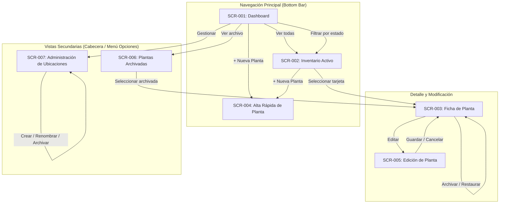

# Especificación de Pantallas (Screens) — Atilio Plants v0.1

Este documento define el catálogo formal de pantallas, su arquitectura de información, jerarquías visuales, estados de interacción y adaptabilidad para **Atilio Plants v0.1 (MVP)**.

---

## 1. Principios de Diseño UX y Contexto de Uso

El diseño de Atilio Plants es estrictamente **Mobile-First**.  
El contexto operativo primario es: *"El usuario está físicamente de pie frente a una planta en su hogar y utiliza su smartphone con una sola mano para consultar o actualizar información."*

### Directrices de Experiencia:
- **Operaciones cotidianas rápidas:** Registro de alta o consulta en pocos toques.
- **Zonas táctiles confortables:** Objetivos táctiles mínimos de 44x44 px situados preferentemente en la zona natural del pulgar (tercio inferior y medio de pantalla).
- **Cero estética ERP:** Interfaz limpia, fresca, orientada a coleccionistas domésticos, sin sobrecarga de tablas densas ni formularios interminables.
- **Tratamiento amigable de datos desconocidos:** Los campos sin información se presentan de forma limpia y contextualizada (ej. texto tenue "Sin especificar" o agrupaciones compactas), prohibiendo mostrar valores "null" literales o llenar la vista de etiquetas vacías.
- **Adaptación Desktop coherente:** En pantallas grandes se aprovecha el ancho para desplegar una grilla de tarjetas responsiva y filtros laterales/superiores permanentes, manteniendo el mismo modelo mental sin transformarse en un software corporativo.

---

## 2. Arquitectura de Información y Estrategia de Navegación

### Evaluación de Alternativas de Navegación Mobile

- **Opción A (Barra de Navegación Inferior / Bottom Navigation Bar):**  
  - *Pros:* Excelente ergonomía táctil en smartphones; acceso inmediato con el pulgar a las vistas principales.
  - *Contras:* Espacio limitado (óptimo para 3 a 5 destinos).
- **Opción B (Menú Lateral / Hamburger Menu):**  
  - *Pros:* Permite albergar muchas opciones.
  - *Contras:* Oculta la navegación primaria ("fuera de la vista, fuera de la mente"), exige dos toques y ubica el botón en la esquina superior izquierda (zona de difícil alcance con una mano).
- **Opción C (Navegación Inferior Híbrida — RECOMENDADA):**  
  - Barra inferior fija para los destinos cotidianos:
    1. **Inicio** (Dashboard: métricas rápidas y estado general).
    2. **Inventario** (Listado completo de plantas activas).
    3. **+ Nueva** (Botón central destacado de acción primaria rápida / FAB o tab).
  - Acciones secundarias o de configuración (Plantas Archivadas, Administración de Ubicaciones) accesibles desde un menú contextual o icono de opciones secundarias en la cabecera del Dashboard / Inventario.
  - *Justificación:* Maximiza la ergonomía móvil cotidiana sin saturar la barra con funciones de baja frecuencia como gestionar ubicaciones o ver plantas muertas/archivadas.

---

## 3. Catálogo de Pantallas (Screens)

### SCR-001: Dashboard (Panel de Inicio)
- **Objetivo:** Brindar un panorama instantáneo del volumen y salud de la colección hogareña y ofrecer vías directas de acción.
- **Información mostrada:**
  - Cabecera con marca: *Atilio Plants*.
  - Indicador numérico principal: Total de plantas activas en la colección.
  - Bloque de distribución sanitaria interactivo: 4 tarjetas/chips con contadores en tiempo real:
    - *Sin evaluar* (`UNKNOWN`)
    - *Saludable* (`HEALTHY`)
    - *Atención* (`ATTENTION`)
    - *Recuperación* (`RECOVERY`)
  - Acceso directo rápido a la colección completa.
  - Botón o tarjeta destacada: "Agregar nueva planta".
- **Acciones principales:**
  - Tap en "Ver Inventario completo" -> Navega a SCR-002.
  - Tap en "+ Agregar Planta" -> Navega a SCR-004.
  - Tap en cualquiera de las métricas de estado (ej. "Atención (2)") -> Navega a SCR-002 con el filtro sanitario preaplicado.
- **Acciones secundarias:**
  - Icono de menú/ajustes secundarios en cabecera: acceso a "Administrar Ubicaciones" (SCR-007) y "Plantas Archivadas" (SCR-006).
- **Estados vacíos (Empty State):**  
  Si no existen plantas activas: Exhibe ilustración neutra, mensaje cálido (*"Tu colección aún no tiene plantas registradas"*) y un botón prominente *"+ Registrar mi primera planta"*.
- **Trazabilidad:** FR-001, FR-002, FR-003, FR-004, FR-005 | US-001.

---

### SCR-002: Inventario Activo
- **Objetivo:** Explorar, buscar, filtrar y seleccionar plantas activas mediante tarjetas visuales.
- **Información mostrada:**
  - Barra superior de búsqueda textual (coincidencias por código `AT-PL-XXX`, nombre común o nombre científico).
  - Fila horizontal deslizable de filtros rápidos:
    - Selector/chips de Estado de Salud (`Todos`, `Sin evaluar`, `Saludable`, `Atención`, `Recuperación`).
    - Menú desplegable de Ubicaciones activas del catálogo (`Todas`, `Living`, `Cocina`, etc.).
    - Selector de Criterio de Ordenamiento (predeterminado: *ID ascendente*; opciones: *Más recientes*, *Nombre común A-Z*).
  - Contador de resultados visibles (ej. "13 ejemplares").
  - Lista/Grilla de tarjetas de plantas:
    - Fotografía principal o ilustración placeholder neutra.
    - Código permanente `AT-PL-XXX` (badge de alta legibilidad).
    - Nombre común destacado.
    - Nombre científico en cursiva (si existe).
    - Badge semántico de estado sanitario con icono y texto.
    - Nombre de la ubicación asignada o texto tenue "Sin ubicación".
- **Acciones principales:**
  - Tap sobre una tarjeta -> Abre Ficha de Planta (SCR-003).
  - Búsqueda en tiempo real al tipear en el input.
  - Selección de filtros o cambio de orden.
- **Acciones secundarias:**
  - Botón flotante (+ FAB) o acceso permanente para agregar planta (SCR-004).
  - Botón "Limpiar filtros" cuando hay filtros activos.
- **Estados vacíos (Empty State):**
  - *Sin coincidencias en búsqueda/filtro:* Mensaje *"No se encontraron plantas con los criterios seleccionados"*, acompañado de botón *"Restablecer filtros"*.
  - *Sin plantas en el sistema:* Redirección sugerida a SCR-004.
- **Adaptación Desktop:** En desktop la fila de tarjetas se transforma en una grilla regular de 3 o 4 columnas, y los filtros se despliegan en una barra superior horizontal expandida o panel lateral.
- **Trazabilidad:** FR-006, FR-007, FR-008, FR-009, FR-010, FR-011, FR-012, FR-013, FR-014, FR-040 | US-002, US-003.

---

### SCR-003: Ficha Individual de Planta
- **Objetivo:** Proporcionar la vista exhaustiva y estructurada de un ejemplar específico.
- **Información mostrada:**
  - **Cabecera Visual:** Fotografía principal del ejemplar en formato grande (aspect ratio optimizado), badge visible e inalterable del código `AT-PL-XXX` y badge de estado de salud.
  - **Sección 1: Identidad:** Nombre común en tipografía destacada, nombre científico (o *"Especie no informada"*), cultivar si existe.
  - **Sección 2: Ubicación:** Nombre del ambiente asignado con icono de localización (o *"Sin ubicación asignada"*).
  - **Sección 3: Estado de Salud y Notas:** Etiqueta semántica de salud (`Sin evaluar`, `Saludable`, `Atención`, `Recuperación`) y bloque de texto con notas u observaciones clínicas. Si no hay notas, se indica *"Sin observaciones registradas"*.
  - **Sección 4: Condiciones Reales de Cultivo Actual:** Tarjetas o lista compacta con:
    - Maceta actual: detalles reales o *"Sin especificar"*.
    - Sustrato actual: mezcla real colocada o *"Sin especificar"*.
    - Luz real: condiciones de iluminación en su ubicación o *"Sin especificar"*.
    - Riego real: notas y observaciones sobre el riego de este ejemplar o *"Sin especificar"*.
  - **Sección 5: Administración:** Fecha de incorporación (ej. *"15 de enero de 2026"*), estado en el ciclo de vida (*Activo* o *Archivado*), fecha de creación y timestamp de última actualización.
  - **Sección 6: Referencia Botánica Externa (Open Plantbook, cuando exista):** Bloque secundario claramente diferenciado que exhibe:
    - Nombre científico de referencia y nombres comunes sugeridos.
    - Cuidados teóricos de la especie: rangos recomendados de temperatura, luz (lux), humedad ambiental y de suelo.
    - Pautas generales de la especie: riego, poda y sustrato ideal teórico.
    - Fotografía de catálogo de la especie (con etiqueta visible: *"Imagen de referencia botánica"*).
    - Timestamp de obtención del snapshot.
    - *Nota:* Si la planta no posee referencia vinculada, se muestra un botón discreto: `[+ Vincular especie desde Open Plantbook]`.
- **Acciones principales:**
  - Botón primario: **"Editar ejemplar"** -> Navega a SCR-005.
- **Acciones secundarias y de Ciclo de Vida:**
  - Botón secundario en pie de ficha: **"Archivar planta"** (en ejemplar activo) o **"Restaurar planta"** (en ejemplar archivado).
  - La acción de archivar se ubica deliberadamente al final de la pantalla, con tratamiento visual neutral/discreto (no botón rojo de borrado destructivo) para evitar confusiones con eliminación de datos.
- **Trazabilidad:** FR-015, FR-016, FR-017, FR-026, FR-028, FR-032, FR-034, FR-049, FR-055 | US-004, US-008, US-009, US-010, US-015.

---

### SCR-004: Alta de Ejemplar (Formulario Progresivo con Enriquecimiento Opcional)
- **Objetivo:** Registrar un nuevo espécimen en la colección en pocos segundos, con posibilidad opcional de enriquecimiento botánico externo.
- **Estrategia de Formulario:**  
  **Formulario Progresivo:**
  1. *Paso Opcional Superior ("Identificar especie con Open Plantbook"):*  
     Campo de búsqueda asíncrono (*"Buscar especie o nombre científico..."*). Al buscar y seleccionar un resultado, el sistema vincula `PlantReference` y precompleta `scientific_name` y sugiere `common_name`.  
     *Acción destacada y no bloqueante:* Enlace inmediato visible **"Continuar sin referencia"** (permite saltar directamente al alta manual sin demoras ni requerimiento de Internet).
  2. *Bloque Esencial de alta inmediata:*  
     - Indicador informativo no editable: *"Código: Asignación automática (ej. AT-PL-014)"*.
     - *Nombre Común:* Campo de texto obligatorio con foco inicial (*"¿Cómo llamás a esta planta?"*).
     - *Fotografía Principal:* Botón táctil para tomar foto con la cámara o seleccionar de la galería local del dispositivo.
     - *Estado de Salud:* Selector de chips con valor predeterminado obligatorio: **Sin evaluar** (`UNKNOWN`).
     - *Ubicación:* Dropdown con catálogo de ubicaciones activas o *"Sin ubicación"*. Enlace discreto: *"+ Nueva ubicación"* (abre SCR-007 en modal).
  3. *Bloque Opcional Plegable ("Condiciones de cultivo y más detalles"):*
     - Nombre científico y cultivar (editables).
     - Fecha de incorporación (selector con fecha actual preseleccionada).
     - Maceta actual y sustrato colocado.
     - Condiciones reales de luz y notas de riego del ejemplar.
     - Observaciones / notas clínicas.
- **Acciones principales:**
  - Botón: **"Guardar planta"** (valida que el nombre común no esté en blanco).
  - Botón: **"Cancelar"** (retorna sin guardar).
- **Feedback:** Al guardar exitosamente, muestra notificación toast (*"Planta AT-PL-XXX creada con éxito"*) y redirige a la ficha del nuevo ejemplar (**SCR-003**, según resolución **PUD-002**).
- **Trazabilidad:** FR-018 a FR-026, FR-038, FR-046 a FR-054 | US-005, US-006, US-014.

---

### SCR-005: Edición de Ejemplar
- **Objetivo:** Actualizar los atributos descriptivos, foto principal, estado de salud, ubicación o condiciones de cultivo de una planta existente.
- **Comportamiento:**
  - Reutiliza exactamente el mismo layout estructurado y controles que el alta.
  - El campo `permanent_code` se muestra bloqueado / de sólo lectura (`AT-PL-XXX`), con un icono de candado o etiqueta informativa aclarando: *"El identificador permanente no puede modificarse"*.
  - *Reemplazo de Fotografía:* Muestra la foto actual con opción clara *"Cambiar fotografía"*. Al seleccionar un archivo nuevo, se exhibe la nueva previsualización y se aclara que la imagen anterior quedará resguardada en el archivo.
- **Acciones:**
  - Botón primario: **"Guardar cambios"** (actualiza timestamp y vuelve a SCR-003).
  - Botón secundario: **"Cancelar"** (descarta cambios y regresa a SCR-003).
- **Trazabilidad:** FR-025, FR-026, FR-027, FR-028, FR-039, FR-043 | US-007, US-013.

---

### SCR-006: Plantas Archivadas (Historial)
- **Objetivo:** Consultar y gestionar los ejemplares que han salido de la colección activa (fallecimiento, obsequio, venta).
- **Información mostrada:**
  - Cabecera distintiva con insignia *"Archivo Histórico"*.
  - Listado de tarjetas de plantas archivadas (con filtro de búsqueda por nombre/código).
  - Cada tarjeta luce un estilo visual más atenuado (escala de grises suave o distintivo "Archivada") pero contiene los mismos datos descriptivos y fotos.
- **Acciones:**
  - Tap en una tarjeta -> Abre la Ficha de Planta (SCR-003) en modo archivado.
  - En la ficha del archivado se ofrece la acción **"Restaurar a la colección activa"**.
- **Estados vacíos (Empty State):**  
  Si no hay plantas archivadas: *"No hay ejemplares en el archivo histórico. Todas tus plantas están activas."*
- **Trazabilidad:** FR-031, FR-032, FR-033, FR-034, FR-035 | US-008, US-009, US-010.

---

### SCR-007: Administración de Ubicaciones (Modal o Pantalla Dedicada)
- **Objetivo:** Gestionar el catálogo de ambientes hogareños (crear, renombrar y archivar).
- **Formato recomendado:** Diálogo modal en desktop / Sheet modal inferior en mobile.
- **Información mostrada:**
  - Input superior: *"+ Nuevo ambiente"* (ej. "Balcón") con botón "Agregar".
  - Lista de ubicaciones activas existentes con contador de plantas asociadas (ej. *"Living (4 plantas)"*).
  - Controles por cada fila de ubicación:
    - Botón para renombrar (edición en línea o diálogo simple).
    - Botón para archivar ambiente (con confirmación clara).
  - Sección inferior colapsable: *"Ubicaciones archivadas"*, permitiendo reactivarlas si vuelven a utilizarse.
- **Regla visual y de integridad:** Al archivar un ambiente con plantas asignadas, un diálogo informa: *"Este ambiente se archivará y no aparecerá para nuevas plantas. Las 4 plantas que están en él conservarán su historial."*
- **Trazabilidad:** FR-037, FR-038, FR-039, FR-040, FR-041 | US-011, US-012.

---

## 4. Tratamiento Semántico de Estados Sanitarios

Para cumplir con las pautas de accesibilidad y claridad cognitiva, el estado sanitario **nunca se comunica únicamente mediante color**. Cada estado combina:
1. **Etiqueta textual en lenguaje humano.**
2. **Icono geométrico representativo.**
3. **Tratamiento cromático con contraste validado.**

| Código de Estado | Etiqueta en Interfaz | Icono Sugerido | Intención Semántica y Prominencia |
| :--- | :--- | :---: | :--- |
| `UNKNOWN` | **Sin evaluar** | ❔ (Círculo punteado / interrogación) | Neutral. Destaca que la planta aún no fue diagnosticada clínicamente. |
| `HEALTHY` | **Saludable** | 🌿 (Brote / hoja turgente) | Positiva. Calma visual, planta vigorosa y sin requerimiento de intervención. |
| `ATTENTION` | **Atención** | ⚠️ (Triángulo de alerta) | Precaución media. Requiere revisión visual (hoja amarilla, sustrato reseco, inicio de plaga). |
| `RECOVERY` | **Recuperación** | 🔄 (Flecha de ciclo / escudo) | Informativo / cuidado activo. Planta bajo tratamiento, trasplante reciente o esqueje. |

---

## 5. Catálogo de Estados Vacíos (Empty States)

1. **Colección inicial vacía (en Dashboard e Inventario):**  
   - *Mensaje:* *"Aún no tenés plantas registradas en Atilio Plants."*  
   - *Acción primaria:* Botón `[+ Registrar mi primera planta]`.
2. **Búsqueda o filtrado sin coincidencias:**  
   - *Mensaje:* *"No encontramos ninguna planta que coincida con tus filtros."*  
   - *Acción:* Botón `[Restablecer búsqueda y filtros]`.
3. **Planta sin fotografía asignada:**  
   - *Visual:* Ilustración silueta geométrica neutra de una planta en maceta.  
   - *Interacción:* En modo edición o ficha, badge discreto `[+ Agregar foto]`.
4. **Archivo histórico vacío:**  
   - *Mensaje:* *"No existen plantas archivadas."*  
   - *Explicación:* *"Los ejemplares que retires de tu colección activa se conservarán aquí."*
5. **Catálogo de ubicaciones vacío:**  
   - *Mensaje:* *"No has definido ambientes todavía."*  
   - *Acción:* Input directo para ingresar *"Living"*, *"Dormitorio"*, etc.

---

## 6. Políticas de Feedback y Confirmaciones de Usuario

- **Feedback Inmediato (Toast / Snackbar no intrusivo):**  
  - *Planta creada:* *"Planta AT-PL-XXX registrada exitosamente."*  
  - *Planta actualizada:* *"Datos del ejemplar actualizados."*  
  - *Fotografía reemplazada:* *"Fotografía actualizada (la foto anterior se guardó en el archivo)."*  
  - *Ubicación creada / renombrada:* *"Ubicación guardada en el catálogo."*  
  - *Planta restaurada:* *"Planta AT-PL-XXX restaurada al inventario activo."*
- **Confirmaciones Requeridas (Diálogos Modales Explícitos):**  
  - *Archivado de planta:* Modal con texto pedagógico:  
    `"¿Archivar esta planta? Pasará al historial archivado conservando todos sus datos y fotos. Podrás consultarla o restaurarla cuando desees."` -> Botones: `[Cancelar]` y `[Archivar ejemplar]`.  
  - *Archivado de ubicación:* Modal informando que las plantas asociadas preservarán su referencia histórica.
- **Operaciones sin confirmación redundante:**  
  - Ediciones de texto o cambios de estado sanitario se guardan de forma directa al pulsar `[Guardar]`.

---

## 7. Directrices de Responsividad y Accesibilidad

### Adaptabilidad por Dispositivo:
- **Mobile (Prioridad Absoluta):**  
  - Viewports de 360px a 430px de ancho.
  - Navegación inferior ergonómica y cards en columna vertical apilada.
  - Targets táctiles mínimos de 44x44px.
  - Formulario de alta progresivo para registro en menos de 10 segundos.
- **Tablet:**  
  - Viewports medianos (768px a 1024px).
  - Tarjetas en grilla de 2 columnas; modales centrados.
- **Desktop:**  
  - Viewports mayores a 1024px.
  - Grilla de tarjetas de 3 o 4 columnas en inventario.
  - Filtros desplegados permanentemente en barra horizontal o panel superior sin perder el modelo mental doméstico.

### Principios de Accesibilidad (a11y):
- Contraste tipográfico conforme a pautas WCAG AA.
- Los estados de salud nunca dependen exclusivamente del color (combinan icono + texto explícito).
- Todos los campos de formulario poseen `<label>` explícitos vinculados.
- Mensajes de validación de error vinculados semánticamente a sus respectivos inputs.
- Navegación completa operable vía teclado en desktop con indicador de foco claramente visible.

---

## 8. Resolved UX Decisions (PUDs Resueltas)

### PUD-001: Presentación de Ubicaciones en la Tarjeta de Inventario cuando no está asignada
- **Estado:** ACCEPTED (Opción A).
- **Decisión:**  
  Cuando una planta no tenga ubicación asignada (`location_id = null`), la tarjeta mostrará el texto atenuado *"Sin ubicación"* con tratamiento visual secundario/discreto. Esto preserva la altura uniforme de las tarjetas en la grilla y mantiene fidelidad estricta al dato sin inventar ni ocultar información.

### PUD-002: Comportamiento de Navegación tras Guardar en Alta
- **Estado:** ACCEPTED (Opción A).
- **Decisión:**  
  Inmediatamente después de pulsar "Guardar planta" en el formulario de alta (SCR-004), el sistema redirigirá al usuario directamente a la **Ficha Individual del nuevo ejemplar (SCR-003)**, ofreciendo visualización completa inmediata de su ID permanente generado (`AT-PL-XXX`) y feedback claro.

---

## 9. Pending UX Decisions

*No existen decisiones de UX pendientes para el alcance del MVP v0.1.*

---

## 10. Análisis de Gaps (UX vs. Requisitos Funcionales)

- **Evaluación de Cobertura:**  
  Todas las pantallas (SCR-001 a SCR-007) y flujos (FLOW-001 a FLOW-011) responden estrictamente a requisitos existentes (**FR-001** a **FR-055**) y User Stories (**US-001** a **US-015**).
- **Gaps Detectados:** **Ninguno.** La integración de Open Plantbook quedó plenamente cubierta mediante SCR-004 (búsqueda opcional no bloqueante) y SCR-003 (sección de referencia botánica secundaria). La experiencia de usuario se mantiene exactamente dentro del perímetro del MVP v0.1.

