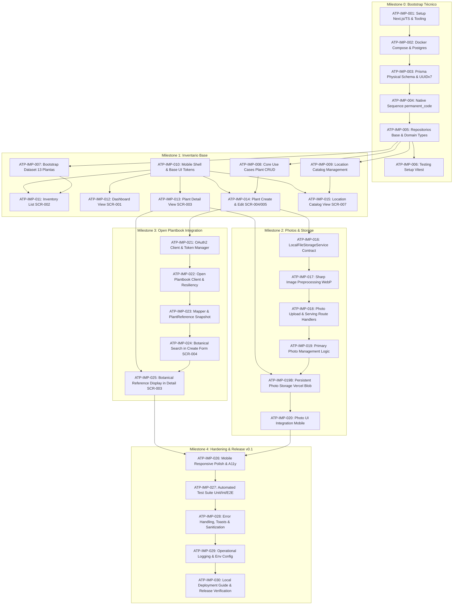

# Backlog de Implementación del MVP v0.1 — Atilio Plants

> **Estado:** Documento de Especificación Aprobado para Ejecución (ATP-008 — Sprint 0)  
> **Alcance:** Desglose exhaustivo de ítems de implementación (`ATP-IMP-001` a `ATP-IMP-030`), dependencias, mapa de arquitectura, Definition of Done, Gates de control, gestión de riesgos y backlog POST-MVP.

---

## 1. Mapa Conceptual de Dependencias

---

## 2. Definición de Hecho (Definition of Done - DoD)

### 2.1 DoD por Ítem de Backlog (ATP-IMP)
Un ítem del backlog se considera **DONE** cuando:
1. **Criterios de Aceptación Cumplidos:** Todos los criterios funcionales y no funcionales del ítem están verificados y pasan satisfactoriamente.
2. **Trazabilidad Respetada:** Cumple estrictamente con los requisitos funcionales (`FR-XXX`), User Stories (`US-XXX`), pantallas (`SCR-XXX`) y decisiones arquitectónicas (`ADR-XXX`) asociados.
3. **Calidad de Código y Tipado:** Pasa `tsc --noEmit` sin errores, linters configurados y no introduce dependencias innecesarias ni desactualizadas.
4. **Pruebas Automatizadas:** Pruebas unitarias o de integración asociadas implementadas y pasando. No se admiten tests comentados o ignorados.
5. **Manejo de Errores y Degradación:** No genera crashes ni unhandled promise rejections; muestra mensajes controlados ante estados fallidos.
6. **Seguridad y Secretos:** Cero credenciales, tokens o secretos hardcodeados en el código. Variables sensibles aisladas server-side.
7. **Documentación:** Se documentan variables de entorno nuevas en `.env.example` y se actualiza la documentación del proyecto si la solución introduce consideraciones operativas.

### 2.2 DoD por Milestone
Un Milestone se considera **COMPLETADO** cuando:
1. Todos los ítems clasificados como **MUST** de ese milestone cumplen su DoD individual.
2. El Gate de Control correspondiente (`GATE-0` a `GATE-4`) ha sido auditado y aprobado.
3. La aplicación levanta localmente mediante Docker Compose sin errores en consola.
4. La base de datos mantiene integridad referencial limpia y reproducible desde cero.

---

## 3. Gates de Control Obligatorios (Quality Gates)

| Gate | Hito Asociado | Condición Innegociable para Avanzar | Estado |
| :--- | :--- | :--- | :--- |
| **GATE-0** | Cierre Milestone 0 | Contenedores Docker / Cloud PostgreSQL (Neon) operativos; Prisma migra la base de datos; la secuencia de PostgreSQL genera códigos atómicos y únicos sin colisiones; el suite completo de tests unitarios y de integración ejecuta en verde. | **APROBADO** |
| **GATE-1** | Cierre Milestone 1 | Las 13 plantas del bootstrap están cargadas con sus estados reales; CRUD de plantas y catálogo de ubicaciones 100% operativo en UI móvil sin recargas forzadas. | **APROBADO** |
| **GATE-2** | Cierre Milestone 2 | Las fotos se procesan en servidor a WebP, se guardan en el volumen montado bajo la jerarquía aprobada y se sirven mediante `resolveUrl()` sin errores; reemplazar foto principal preserva el archivo físico previo. | **APROBADO** |
| **GATE-3** | Cierre Milestone 3 | Búsqueda botánica funcional en modal; persistencia del snapshot `PlantReference`; la aplicación sigue operando y guardando plantas si Open Plantbook se desconecta o devuelve HTTP 429. | **APROBADO** |
| **GATE-4** | Cierre Milestone 4 | Interfaz responsiva mobile-first testeada; suite completa de tests automatizados pasa; guía de instalación local probada en entorno limpio. Release v0.1 lista. | **APROBADO** |

---

## 4. Desglose Exhaustivo de Ítems de Backlog

### Milestone 0 — Bootstrap Técnico & Persistencia

#### `ATP-IMP-001` — Inicialización del Proyecto Next.js, TypeScript y Tooling
- **Estado:** `COMPLETADO`
- **Objetivo:** Disponer del scaffolding base del monolito full-stack con TypeScript estricto.
- **Tipo:** `FOUNDATION` | **Prioridad:** `MUST` | **Release:** `M0`
- **Dependencias:** Ninguna (primer paso de implementación).
- **Trazabilidad:** `NFR-004`, `NFR-012`, `ADR-014`.
- **Criterios de Aceptación:**
  - Next.js (App Router) configurado con Node.js LTS soportado oficialmente.
  - TypeScript configurado con modo estricto (`strict: true`, paths aliases `@/*`).
  - Estructura base de carpetas creada según arquitectura (`src/app`, `src/components`, `src/features`, `src/core`, `src/infrastructure`, `src/integrations`).
  - Configuración de `.gitignore` excluyendo `.next`, `node_modules`, `.env*.local`, y `storage/photos/*`.
- **Resultado:** Proyecto base compila y ejecuta con `npm run dev`.

#### `ATP-IMP-002` — Entorno de Infraestructura: Docker Compose y PostgreSQL (Local / Cloud)
- **Estado:** `COMPLETADO`
- **Objetivo:** Orquestar el entorno de ejecución reproducible (Docker Compose multi-stage) y habilitar la infraestructura de PostgreSQL (PostgreSQL 16+ en la nube para despliegue continuo en Vercel o contenedor local).
- **Tipo:** `DEVOPS` | **Prioridad:** `MUST` | **Release:** `M0`
- **Dependencias:** `ATP-IMP-001`.
- **Trazabilidad:** `NFR-001`, `NFR-002`, `ADR-005`, `ADR-018`.
- **Criterios de Aceptación:**
  - Archivo `docker-compose.yml` completo con servicios `postgres` (`postgres:16-alpine`, loopback 127.0.0.1, healthcheck) y `app` (multi-stage `Dockerfile`, Node.js 24 LTS, volumen `./storage:/app/storage`).
  - Volumen persistente para la base de datos (`postgres_data`).
  - Archivo `.env.example` con variables documentadas y placeholders seguros (`DATABASE_URL`, `POSTGRES_*`, `STORAGE_LOCAL_PATH`).
  - Soporte de despliegue en Vercel y compatibilidad con PostgreSQL gestionado en la nube (`ADR-018`).
- **Resultado:** Infraestructura declarada, lista para conexión de Prisma (`ATP-IMP-003`) y pipeline de despliegue en Vercel.

#### `ATP-IMP-003` — Esquema Físico Prisma, UUIDv7 y Modelado Relacional
- **Estado:** `COMPLETADO`
- **Objetivo:** Diseñar el esquema físico relacional en Prisma y configurar identificadores UUIDv7.
- **Tipo:** `DATA` | **Prioridad:** `MUST` | **Release:** `M0`
- **Dependencias:** `ATP-IMP-002`.
- **Trazabilidad:** `FR-001`, `FR-006`, `FR-016`, `FR-037`, `ADR-015`, `ADR-016`.
- **Criterios de Aceptación:**
  - Modelos Prisma para `Plant`, `Location`, `Photo`, `PlantCultivationProfile` y `PlantReference`.
  - Definición de Enums para `HealthStatus` (`UNKNOWN`, `HEALTHY`, `ATTENTION`, `RECOVERY`) y `LifecycleStatus` (`ACTIVE`, `ARCHIVED`).
  - Claves primarias técnicas configuradas como UUIDv7.
  - Campos `raw_data` y `reference_care` en `PlantReference` modelados como `Json` (PostgreSQL `JSONB`).
  - Integridad referencial con claves foráneas e índices (`plant_id`, `location_id`, `reference_id`, `(provider, external_id)` unique).
- **Resultado:** Archivo `prisma/schema.prisma` sintácticamente válido y compatible con PostgreSQL.

#### `ATP-IMP-004` — Secuencia Nativa PostgreSQL para `permanent_code` (`AT-PL-XXX`)
- **Estado:** `COMPLETADO`
- **Objetivo:** Implementar la generación atómica server-side del código permanente humano.
- **Tipo:** `DATA` | **Prioridad:** `MUST` | **Release:** `M0`
- **Dependencias:** `ATP-IMP-003`.
- **Trazabilidad:** `FR-002`, `FR-004`, `FR-005`, `ADR-002`, `ADR-017`, `PAD-001`.
- **Criterios de Aceptación:**
  - Migración física de PostgreSQL que crea la secuencia dedicada `CREATE SEQUENCE plant_code_seq` (la creación de la secuencia es responsabilidad de la migración/DDL, no del repositorio).
  - La capa de persistencia/repositorio consume atómicamente el siguiente valor numérico (`nextval`).
  - La lógica de aplicación/dominio formatea el código como `AT-PL-` + número con padding mínimo de 3 dígitos (ej. `AT-PL-014`).
  - Operación atómica a nivel de motor; segura ante llamadas concurrentes; no sufre colisiones ni reutilización.
  - Los gaps numéricos por transacciones fallidas están formalmente aceptados.
- **Resultado:** Mecanismo de generación seguro, atómico y desacoplado, validado contra PostgreSQL real (Neon) y testeado en concurrencia sin colisiones. GATE-0 certificado.

#### `ATP-IMP-005` — Capa de Repositorios Base y Modelos de Dominio Aislados
- **Estado:** `COMPLETADO`
- **Objetivo:** Aislar la capa de persistencia mediante el patrón repositorio para proteger al dominio de Prisma.
- **Tipo:** `BACKEND` | **Prioridad:** `MUST` | **Release:** `M0`
- **Dependencias:** `ATP-IMP-003`.
- **Trazabilidad:** `NFR-003`, `ADR-014`, `ADR-015`.
- **Criterios de Aceptación:**
  - Interfaces abstractas `IPlantRepository`, `ILocationRepository` en `src/core/domain/repositories/`.
  - Implementaciones concretas `PrismaPlantRepository`, `PrismaLocationRepository` en `src/infrastructure/db/`.
  - Modelos puros de TypeScript en Dominio; ningún tipo generado por Prisma atraviesa la frontera hacia Aplicación o Dominio.
  - Singleton de `PrismaClient` correctamente instanciado evitando agotamiento de conexiones en desarrollo.
- **Resultado:** Repositorios tipados capaces de realizar operaciones CRUD básicas.

#### `ATP-IMP-006` — Configuración del Framework de Testing (Vitest & Testing Library)
- **Estado:** `COMPLETADO`
- **Objetivo:** Establecer la infraestructura de testing automatizado para pruebas unitarias y de integración.
- **Tipo:** `TEST` | **Prioridad:** `MUST` | **Release:** `M0`
- **Dependencias:** `ATP-IMP-001`.
- **Trazabilidad:** `NFR-012`.
- **Criterios de Aceptación:**
  - Configuración de Vitest para entorno Node y JSDOM.
  - Scripts en `package.json` (`test`, `test:watch`, `test:coverage`).
  - Test de humo que verifica la compilación de tipos y el entorno de ejecución.
- **Resultado:** `npm run test` ejecuta la suite en milisegundos.

---

### Milestone 1 — Inventario Base & Catálogo

#### `ATP-IMP-007` — Script de Carga Bootstrap del Inventario Inicial (13 Plantas)
- **Estado:** `COMPLETADO`
- **Objetivo:** Poblar la base de datos con el dataset real de los 13 ejemplares físicos existentes.
- **Tipo:** `DATA` | **Prioridad:** `MUST` | **Release:** `M1`
- **Dependencias:** `ATP-IMP-004`, `ATP-IMP-005`.
- **Trazabilidad:** `FR-003`, `INITIAL_INVENTORY.md`.
- **Criterios de Aceptación:**
  - Script `prisma/seed.ts` que inserta exactamente las 13 plantas (`AT-PL-001` a `AT-PL-013`) con sus nombres comunes, especies, cultivares y notas textuales.
  - Respeta los códigos e identidades existentes sin regenerarlos; preserva `permanent_code` inmutables.
  - Respeta los estados sanitarios iniciales según `INITIAL_INVENTORY.md`: 10 `HEALTHY` (`AT-PL-001`, `002`, `005`, `007`, `008`, `009`, `010`, `011`, `012`, `013`), 2 `ATTENTION` (`AT-PL-003`, `AT-PL-006`), 1 `RECOVERY` (`AT-PL-004`), 0 `UNKNOWN`.
  - Solo `AT-PL-013` posee `acquisition_date = 2026-09-05`; las demás 12 poseen `acquisition_date = null`.
  - Todas las 13 plantas tienen `location_id = null`, `reference_id = null`, ausencia de `Photo` y ausencia de `PlantCultivationProfile`.
  - **Alineación de Secuencia:** Tras importar los códigos existentes, la secuencia `plant_code_seq` debe alinearse conceptualmente con el máximo componente numérico histórico ya persistido (en este dataset inicial el máximo es 13), asegurando que el próximo alta genere el valor 14 sin reservar manualmente `AT-PL-014`.
  - El script debe ser seguro y repetible ante ejecuciones controladas de seed.
- **Resultado:** Base de datos inicializada con el inventario real y la secuencia correctamente sincronizada. Testeado y verificado en Neon.

#### `ATP-IMP-008` — Casos de Uso del Dominio Plantas (CRUD & Lifecycle)
- **Estado:** `COMPLETADO`
- **Objetivo:** Implementar la lógica de negocio pura para administración de plantas.
- **Tipo:** `BACKEND` | **Prioridad:** `MUST` | **Release:** `M1`
- **Dependencias:** `ATP-IMP-005`.
- **Trazabilidad:** `FR-007`, `FR-009`, `FR-011`, `FR-013`, `FR-014`, `FR-015`, `US-001` a `US-005`, `FLOW-001`, `FLOW-003`, `FLOW-004`.
- **Criterios de Aceptación:**
  - `CreatePlantUseCase`: asigna `permanent_code` vía secuencia, estado `UNKNOWN` por defecto (`ADR-009`) si no se indica otro, valida campos requeridos (rechaza `common_name` vacío).
  - `UpdatePlantUseCase`: permite modificar atributos mutables; prohíbe terminantemente alterar `permanent_code`, `id` o `lifecycle_status`.
  - `ArchivePlantUseCase`: soft delete cambiando `lifecycle_status = 'ARCHIVED'` (`ADR-004`), preservando el código e identidad histórica de forma idempotente.
  - `RestorePlantUseCase`: permite desarchivar una planta retornándola a `lifecycle_status = 'ACTIVE'` de forma idempotente.
  - `ListPlantsUseCase` y `GetPlantUseCase`: consultas con filtros por estado sanitario, ubicación y búsqueda por nombre o código, manteniendo orden por defecto `permanent_code ASC`.
- **Resultado:** Casos de uso 100% desacoplados de Prisma/Next.js, con errores de aplicación dedicados y suite exhaustiva de tests unitarios pasando.

#### `ATP-IMP-009` — Casos de Uso y Gestión del Catálogo de Ubicaciones
- **Estado:** `COMPLETADO`
- **Objetivo:** Implementar la administración de ubicaciones físicas sin admitir texto libre.
- **Tipo:** `BACKEND` | **Prioridad:** `MUST` | **Release:** `M1`
- **Dependencias:** `ATP-IMP-005`.
- **Trazabilidad:** `FR-016` a `FR-023`, `US-006`, `US-007`, `FLOW-005`, `FLOW-006`, `ADR-007`.
- **Criterios de Aceptación:**
  - `CreateLocationUseCase`: valida nombre no vacío (2-50 chars con trim), unicidad insensible a mayúsculas entre activas.
  - `RenameLocationUseCase`: actualiza nombre validando no colisionar con otra activa (permite conservar el propio).
  - `ArchiveLocationUseCase`: archiva la ubicación (soft delete idempotente); las plantas históricas la conservan pero no se ofrece para nuevas asignaciones.
  - `RestoreLocationUseCase`: restaura a activa anticipando colisiones de nombre contra otras activas.
  - `ListLocationsUseCase`: lista activas (para selectores de formularios) o todas (para pantalla de gestión), ordenadas por nombre ASC.
- **Resultado:** Lógica de catálogo de ubicaciones testeada, desacoplada y protegida contra inconsistencias mediante tests unitarios y de integración física contra PostgreSQL.

#### `ATP-IMP-010` — Shell Mobile-First, Tokens de Diseño y Componentes Base
- **Estado:** `COMPLETADO`
- **Objetivo:** Crear la estructura visual responsiva y el sistema de diseño móvil de la aplicación.
- **Tipo:** `FRONTEND` | **Prioridad:** `MUST` | **Release:** `M1`
- **Dependencias:** `ATP-IMP-001`.
- **Trazabilidad:** `NFR-004`, `NFR-005`, `SCR-001` a `SCR-007`.
- **Criterios de Aceptación:**
  - Layout general con barra superior (`TopBar`) y barra de navegación inferior fija (`BottomNav`) para mobile (`Dashboard` SCR-001, `Inventario` SCR-002, acción central de alta SCR-004).
  - Acceso a vistas secundarias (`Plantas Archivadas` SCR-006, `Administración de Ubicaciones` SCR-007) desde cabecera/menú secundario.
  - Tokens CSS / Tailwind con paleta de colores semántica para estados sanitarios: Verde (`HEALTHY`), Ámbar/Amarillo (`ATTENTION`), Naranja/Rojo suave (`RECOVERY`), Gris atenuado (`UNKNOWN`).
  - Componentes reutilizables: `Button` (con target táctil adecuado para uso móvil con una sola mano), `HealthBadge`, `Input`, `Select`, `Modal`, `EmptyState`.
- **Resultado:** Shell móvil funcional y navegable entre pantallas principales.

#### `ATP-IMP-011` — Pantalla de Inventario / Catálogo de Plantas Activas (`SCR-002`)
- **Estado:** `COMPLETADO`
- **Objetivo:** Implementar la pantalla principal de catálogo de ejemplares activos.
- **Tipo:** `FRONTEND` | **Prioridad:** `MUST` | **Release:** `M1`
- **Dependencias:** `ATP-IMP-008`, `ATP-IMP-010`.
- **Trazabilidad:** `FR-024` a `FR-030`, `US-008`, `US-009`, `SCR-002`, `FLOW-002`, `PFD-002`.
- **Criterios de Aceptación:**
  - Visualización en grilla/tarjetas de ejemplares activos ordenados por defecto por `permanent_code` ascendente (`AT-PL-001`, `AT-PL-002`, etc.).
  - Selector de ordenación alternativa: nombre común ascendente, fecha de registro.
  - Barra de búsqueda por texto (filtra en vivo por nombre o código).
  - Filtros rápidos por estado de salud (`HEALTHY`, `ATTENTION`, `RECOVERY`, `UNKNOWN`) y por ubicación.
  - Indicador de ubicación (o etiqueta "Sin ubicación" atenuada si es null).
  - Tarjeta de planta (`PlantCard`) con código visible, badge sanitario, nombre común y científico. Al pulsarla navega a la Ficha Individual (`SCR-003`).
- **Resultado:** Listado fluido y responsivo que muestra los 13 ejemplares cargados.

#### `ATP-IMP-012` — Pantalla de Dashboard Resumen (`SCR-001`)
- **Estado:** `COMPLETADO`
- **Objetivo:** Proveer la vista panorámica del estado sanitario de la colección botánica.
- **Tipo:** `FRONTEND` | **Prioridad:** `MUST` | **Release:** `M1`
- **Dependencias:** `ATP-IMP-008`, `ATP-IMP-010`.
- **Trazabilidad:** `FR-031` a `FR-034`, `US-010`, `SCR-001`.
- **Criterios de Aceptación:**
  - Métricas visuales de cabecera: Total de plantas activas, desglose por estado sanitario (`Saludables`, `Atención`, `Recuperación`, `Sin evaluar`).
  - Acceso directo al tocar una métrica para filtrar el inventario (`SCR-002`) por ese estado sanitario.
  - Acceso rápido para registrar nuevo ejemplar (`SCR-004`).
  - Enlace hacia administración de ubicaciones (`SCR-007`) y plantas archivadas (`SCR-006`).
  - Mensaje contextual de bienvenida o síntesis del estado general.
- **Resultado:** Dashboard informativo y responsivo en mobile y desktop.

#### `ATP-IMP-013` — Ficha Individual de Ejemplar (`SCR-003`)
- **Estado:** `COMPLETADO`
- **Objetivo:** Construir la vista integral de consulta de un ejemplar individual.
- **Tipo:** `FRONTEND` | **Prioridad:** `MUST` | **Release:** `M1`
- **Dependencias:** `ATP-IMP-008`, `ATP-IMP-010`.
- **Trazabilidad:** `FR-035` a `FR-038`, `US-002`, `SCR-003`.
- **Criterios de Aceptación:**
  - Header con código permanente destacado (`AT-PL-XXX`), nombre común, cultivar y badge de salud.
  - Sección de taxonomía: Nombre científico y fecha de adquisición (o "No declarada").
  - Sección de ubicación actual (o "Sin ubicación").
  - Sección de perfil de cultivo (`PlantCultivationProfile`): maceta física, sustrato, notas de luz y riego (o "Sin datos de cultivo").
  - Menú de acciones secundarias: "Editar ejemplar" (navega a `SCR-005`), "Archivar ejemplar" (con diálogo de confirmación y traslado a `SCR-006`).
- **Resultado:** Ficha completa y limpia accesible desde cualquier tarjeta del inventario.

#### `ATP-IMP-014` — Formularios de Alta (`SCR-004`) y Edición (`SCR-005`)
- **Estado:** `COMPLETADO`
- **Objetivo:** Implementar los flujos de creación y actualización de plantas mediante Server Actions.
- **Tipo:** `FRONTEND` | **Prioridad:** `MUST` | **Release:** `M1`
- **Dependencias:** `ATP-IMP-008`, `ATP-IMP-009`, `ATP-IMP-010`.
- **Trazabilidad:** `FR-007` a `FR-012`, `US-001`, `US-003`, `SCR-004`, `SCR-005`, `FLOW-001`, `FLOW-003`.
- **Criterios de Aceptación:**
  - Formulario de alta (`SCR-004`) con validación cliente/servidor (Zod): nombre común obligatorio, selector de ubicación desde catálogo activo, estado de salud (por defecto `Sin evaluar`).
  - Campos de cultivo opcionales (maceta, sustrato, notas de luz/riego).
  - Formulario de edición (`SCR-005`): precarga datos existentes; campo `permanent_code` mostrado en solo lectura o bloqueado; permite actualizar ubicación o removerla.
  - Retroalimentación con toast tras éxito y redirección a la ficha del ejemplar (`SCR-003`).
- **Resultado:** Flujos de alta y edición 100% operativos en mobile.

#### `ATP-IMP-015` — Pantallas de Plantas Archivadas (`SCR-006`) y Catálogo de Ubicaciones (`SCR-007`)
- **Estado:** `COMPLETADO`
- **Objetivo:** Proveer la interfaz para consulta de histórico archivado y administración de las ubicaciones del hogar.
- **Tipo:** `FRONTEND` | **Prioridad:** `MUST` | **Release:** `M1`
- **Dependencias:** `ATP-IMP-008`, `ATP-IMP-009`, `ATP-IMP-010`.
- **Trazabilidad:** `FR-014`, `FR-015`, `FR-017` a `FR-022`, `US-005`, `US-006`, `US-007`, `SCR-006`, `SCR-007`, `FLOW-004`, `FLOW-005`, `FLOW-006`, `ADR-004`, `ADR-007`.
- **Criterios de Aceptación:**
  - Vista de Plantas Archivadas (`SCR-006`): listado histórico con opción de restauración hacia el inventario activo.
  - Vista de Administración de Ubicaciones (`SCR-007`): lista de ubicaciones activas con conteo de ejemplares asociados en tiempo real.
  - Botón y modal para "Crear ubicación" con validación de unicidad.
  - Opción para renombrar ubicación existente y archivar ubicación con diálogo de confirmación (aclara que las plantas actuales la conservan).
- **Resultado:** Módulos de consulta histórica y administración de ubicaciones independientes y funcionales.

---

### Milestone 2 — Almacenamiento & Fotografía

#### `ATP-IMP-016` — Contrato `IFileStorageService` e Implementación `LocalFileStorage`
- **Estado:** `COMPLETADO`
- **Objetivo:** Construir la capa de abstracción de almacenamiento de archivos en disco.
- **Tipo:** `STORAGE` | **Prioridad:** `MUST` | **Release:** `M2`
- **Dependencias:** `ATP-IMP-002`, `ATP-IMP-005`.
- **Trazabilidad:** `NFR-007`, `ADR-006`, `ADR-011`, `PAD-002`.
- **Criterios de Aceptación:**
  - Interfaz `IFileStorageService` (`saveFile`, `resolveUrl`, `fileExists`, `deleteFile`).
  - Implementación `LocalFileStorageService` que escribe bajo la ruta montada del host: `photos/{permanent_code}/{uuid}.{ext}`.
  - Método `resolveUrl(storageKey)` que devuelve la URL relativa controlada por la aplicación (ej. `/api/photos/view/...`).
  - Creación automática de directorios por planta (`photos/AT-PL-XXX/`) si no existen.
  - Pruebas de integración sobre sistema de archivos temporal.
- **Resultado:** Servicio desacoplado capaz de persistir y resolver URLs sin depender de paths absolutos del host.

#### `ATP-IMP-017` — Pipeline de Preprocesamiento de Imágenes Server-Side (`sharp`)
- **Estado:** `COMPLETADO`
- **Objetivo:** Normalizar y optimizar fotografías tomadas desde dispositivos móviles.
- **Tipo:** `BACKEND` | **Prioridad:** `MUST` | **Release:** `M2`
- **Dependencias:** `ATP-IMP-016`.
- **Trazabilidad:** `NFR-006`, `NFR-008`, `PAD-003`.
- **Criterios de Aceptación:**
  - Integración de biblioteca `sharp` en el runtime de Node.js.
  - Pipeline que aplica corrección de orientación EXIF automática (`.rotate()`).
  - Redimensionamiento proporcional de imágenes excesivamente grandes (configurable).
  - Conversión y compresión a formato **WebP** optimizado.
  - Manejo de excepciones ante archivos corruptos o formatos inválidos.
- **Resultado:** Módulo procesador que toma cualquier imagen móvil y retorna un buffer WebP ligero y estandarizado.

#### `ATP-IMP-018` — Route Handlers de Subida y Serving de Fotos
- **Estado:** `COMPLETADO`
- **Objetivo:** Proveer los puntos de entrada HTTP para la carga y entrega de binarios.
- **Tipo:** `BACKEND` | **Prioridad:** `MUST` | **Release:** `M2`
- **Dependencias:** `ATP-IMP-016`, `ATP-IMP-017`.
- **Trazabilidad:** `NFR-007`, `NFR-014`, `ADR-013`.
- **Criterios de Aceptación:**
- `POST /api/photos/upload`: recibe `multipart/form-data`, valida MIME (`jpeg`, `png`, `webp`), delega al preprocesador y almacena vía `StorageService`.
- `GET /api/photos/view/[...storageKey]`: lee el binario del storage y responde con `Content-Type: image/webp`, `Cache-Control: public, max-age=31536000, immutable` y `X-Content-Type-Options: nosniff`.
- Respuestas HTTP estructuradas con códigos semánticos.
- **Resultado:** Endpoints probados y seguros para streaming de imágenes y subida.

#### `ATP-IMP-019` — Lógica de Reemplazo y Preservación de Foto Principal
- **Estado:** `COMPLETADO`
- **Objetivo:** Administrar el flag `Photo.is_primary` preservando los binarios anteriores en disco.
- **Tipo:** `BACKEND` | **Prioridad:** `MUST` | **Release:** `M2`
- **Dependencias:** `ATP-IMP-018`.
- **Trazabilidad:** `FR-039` a `FR-045`, `US-011` a `US-013`, `ADR-008`, `ADR-010`.
- **Criterios de Aceptación:**
- Al marcar una nueva foto como principal, se ejecuta transacción en base de datos: las fotos anteriores del ejemplar pasan a `is_primary = false`.
- **Prohibición de borrado físico:** el archivo en disco de la foto previa no es eliminado (`ADR-008`).
- La entidad `Plant` no almacena clave foránea `primary_photo_id`; la consulta proyecta la foto con `is_primary = true` (`ADR-010`).
- **Resultado:** Integridad estricta garantizada: como máximo 1 foto principal activa por planta, con histórico preservado.

#### `ATP-IMP-019B` — Storage Persistente de Fotos para Producción Vercel (`VercelBlobStorageService`)
- **Estado:** `COMPLETADO`
- **Objetivo:** Proveer un backend de almacenamiento persistente en la nube (Vercel Blob) bajo el contrato `IFileStorageService` para entornos Vercel, manteniendo el soporte de `LocalFileStorageService` para local/Docker.
- **Tipo:** `STORAGE` | **Prioridad:** `MUST` | **Release:** `M2`
- **Dependencias:** `ATP-IMP-016`, `ATP-IMP-018`.
- **Trazabilidad:** `NFR-007`, `ADR-006`, `ADR-011`.
- **Criterios de Aceptación:**
- Implementación de `VercelBlobStorageService` que satisface `IFileStorageService` usando `@vercel/blob` (`put`, `head`, `get`, `del`).
- Preservación estricta de storage keys lógicas portables (`photos/{permanent_code}/{uuid}.webp`).
- Selección centralizada en `serviceContainer`: `VercelBlobStorageService` si existe `BLOB_READ_WRITE_TOKEN` / `STORAGE_DRIVER=blob`, `LocalFileStorageService` para local/docker, o `StorageUnavailableError` si corre en Vercel sin credenciales.
- Bloqueo de path traversal y validación con `isValidStorageKey()`.
- Suite completa de tests unitarios, suite de contrato y verificación en producción.
- **Resultado:** Almacenamiento durable y desacoplado operativo tanto en local como en producción Vercel.

#### `ATP-IMP-020` — Integración UI Móvil de Fotos en Ficha, Catálogo y Formularios
- **Estado:** `COMPLETADO`
- **Objetivo:** Mostrar y permitir la captura de fotos desde la interfaz de usuario.
- **Tipo:** `FRONTEND` | **Prioridad:** `MUST` | **Release:** `M2`
- **Dependencias:** `ATP-IMP-018`, `ATP-IMP-019`, `ATP-IMP-011`, `ATP-IMP-013`.
- **Trazabilidad:** `SCR-002`, `SCR-003`, `SCR-004`, `SCR-005`, `FLOW-007`.
- **Criterios de Aceptación:**
  - Componente de subida con input file nativo (`capture="environment"` para cámara móvil en alta `SCR-004` y edición `SCR-005`).
  - Preview visual inmediato antes de confirmar el guardado con ciclo de vida seguro de object URLs.
  - Avatar / Thumbnail de foto principal en las tarjetas del inventario activo (`SCR-002`) y dashboard (`SCR-001`).
  - Imagen destacada en la cabecera de la ficha individual (`SCR-003`).
  - Placeholder visual botánico sobrio para ejemplares sin fotografía registrada (`aria-hidden="true"`).
  - Orquestación server-side con compensación automática de binarios huérfanos sin afectar histórico (ADR-008).
- **Resultado:** Experiencia fotográfica completa y fluida en dispositivos móviles con 0 N+1 queries.

---

### Milestone 3 — Integración Open Plantbook

#### `ATP-IMP-021` — Gestor de Tokens OAuth2 Server-Side (`OAuth2TokenManager`)
- **Objetivo:** Implementar la autenticación segura Client Credentials con el proveedor externo.
- **Tipo:** `INTEGRATION` | **Prioridad:** `MUST` | **Release:** `M3` | **Estado:** `COMPLETADO`
- **Dependencias:** `ATP-IMP-001`.
- **Trazabilidad:** `NFR-013`, `NFR-017`, `ADR-013`, `OPEN_PLANTBOOK_INTEGRATION.md`.
- **Criterios de Aceptación:**
  - Lee credenciales `OPEN_PLANTBOOK_CLIENT_ID` y `CLIENT_SECRET` exclusivamente desde variables de entorno del servidor.
  - Solicita token Bearer a `POST https://open.plantbook.io/api/v1/token/`.
  - Mantiene el token en memoria caché de servidor mientras sea válido, renovándolo automáticamente antes de su expiración (ventana de seguridad adaptativa: `min(60s, 20% TTL)`).
  - Protección de concurrencia mediante compartición de promesa in-flight para evitar thundering herd.
  - Cero exposición de secretos o tokens hacia el bundle cliente del navegador (`server-only`).
- **Resultado:** Módulo `OAuth2TokenManager` implementado y testeado unitariamente cubriendo los 13 escenarios de autenticación, caché, concurrencia, timeout y sanitización (30 test files, 323 tests passing).

#### `ATP-IMP-022` — Cliente HTTP Resiliente Open Plantbook (`OpenPlantbookClient`)
- **Objetivo:** Implementar el cliente HTTP con tolerancia a fallos, rate limits y timeouts.
- **Tipo:** `INTEGRATION` | **Prioridad:** `MUST` | **Release:** `M3` | **Estado:** `COMPLETADO`
- **Dependencias:** `ATP-IMP-021`.
- **Trazabilidad:** `NFR-016`, `NFR-018`, `OPEN_PLANTBOOK_INTEGRATION.md`.
- **Criterios de Aceptación:**
  - Timeout estricto de petición saliente de **5000 ms** con `AbortController`.
  - Método de búsqueda de especies (`GET /api/v1/plant/search/?alias=...`) con encoding seguro y validación de query no vacía.
  - Método de detalle completo (`GET /api/v1/plant/detail/{pid}/?include=*`) con encoding seguro de PID.
  - Manejo estructurado de errores: captura HTTP 429 (`OpenPlantbookRateLimitError` con `Retry-After`), HTTP 404 (`OpenPlantbookPlantNotFoundError`), errores 5xx (`OpenPlantbookServiceUnavailableError`), timeout y network errors sin exponer secrets.
  - Preservación del payload `raw` para persistencia snapshot en ATP-IMP-023.
- **Resultado:** Cliente `OpenPlantbookClient` implementado con arquitectura Clean Architecture y testeado exhaustivamente con MSW (Mock Service Worker) cubriendo 17 escenarios (A–R).

#### `ATP-IMP-023` — Mapper y Persistencia del Snapshot Local `PlantReference`
- **Objetivo:** Mapear payloads externos a entidades de dominio y persistirlos en PostgreSQL.
- **Tipo:** `DATA` | **Prioridad:** `MUST` | **Release:** `M3` | **Estado:** `COMPLETADO`
- **Dependencias:** `ATP-IMP-005`, `ATP-IMP-022`.
- **Trazabilidad:** `FR-046` a `FR-050`, `US-014`, `ADR-012`.
- **Criterios de Aceptación:**
  - `OpenPlantbookMapper` transforma el JSON crudo en la entidad `PlantReference` extrayendo: nombres botánicos, umbrales numéricos (luz, temperatura, humedad) e instrucciones cualitativas en `reference_care` (JSONB).
  - Persiste el payload íntegro en `raw_data` (JSONB).
  - Clave lógica compuesta única `(provider = 'OPEN_PLANTBOOK', external_id = pid)` con manejo seguro de concurrencia.
  - Caso de uso `GetOrCreatePlantReferenceUseCase` reutiliza snapshots locales de forma local-first sin round-trips externos innecesarios.
  - El snapshot local es permanente ante caídas posteriores de Open Plantbook.
- **Resultado:** Repositorio `PrismaPlantReferenceRepository`, mapper `OpenPlantbookMapper` y caso de uso `GetOrCreatePlantReferenceUseCase` implementados y certificados con tests unitarios y de integración real en PostgreSQL (JSONB round-trip y concurrencia).

#### `ATP-IMP-024` — Búsqueda y Vinculación Asistida en Formulario de Alta (`SCR-004`)
- **Objetivo:** Permitir al usuario buscar y vincular una especie dentro del flujo de creación/edición de planta.
- **Tipo:** `FRONTEND` | **Prioridad:** `MUST` | **Release:** `M3` | **Estado:** `COMPLETADO`
- **Dependencias:** `ATP-IMP-022`, `ATP-IMP-023`, `ATP-IMP-014`.
- **Trazabilidad:** `FR-051` a `FR-055`, `US-014`, `US-015`, `SCR-004`, `FLOW-008`, `FLOW-009`.
- **Criterios de Aceptación:**
  - Componente de búsqueda integrado/modal invocado desde el formulario de alta (`SCR-004`) o edición (`SCR-005`) en el campo de especie.
  - Input con debouncing que consulta el Route Handler proxy `/api/integrations/plantbook/search`.
  - Lista de resultados con nombre científico, nombres comunes y opción de seleccionar.
  - **No bloqueante:** opción clara para "Continuar sin referencia" o cancelar.
  - Si el servicio devuelve 429 o error de red, muestra aviso amigable sin bloquear el formulario de la planta (`FLOW-008`).
- **Resultado:** Flujo de búsqueda asistida no bloqueante integrado en los formularios de ejemplar con `BotanicalReferencePicker` debounced (400ms), cancelación `AbortController`, preview de referencia botánica, autocompletado respetuoso y persistencia de snapshot local server-side.

#### `ATP-IMP-025` — Visualización de Referencia Botánica en Ficha Individual (`SCR-003`)
- **Objetivo:** Mostrar los requerimientos de la especie en la ficha de detalle del ejemplar.
- **Tipo:** `FRONTEND` | **Prioridad:** `MUST` | **Release:** `M3` | **Estado:** `COMPLETADO`
- **Dependencias:** `ATP-IMP-023`, `ATP-IMP-013`.
- **Trazabilidad:** `FR-055`, `US-015`, `SCR-003`.
- **Criterios de Aceptación:**
  - Sección en la Ficha Individual (`SCR-003`) titulada "Conocimiento Botánico de Referencia" cuando la planta tiene `reference_id` vinculado.
  - Visualización de umbrales ambientales (rango de lux óptimo, temperatura mínima/máxima, humedad ambiental).
  - Guía teórica de riego y sustrato provista por el proveedor.
  - Leyenda aclaratoria que indica el origen del dato ("Fuente: Open Plantbook") y su fecha de sincronización.
  - Si la planta no tiene referencia, la sección se oculta limpiamente sin generar espacios en blanco vacíos.
- **Resultado:** Enriquecimiento visual contextual del ejemplar sin acoplar datos físicos, alimentado de forma 100% Local-First a partir del snapshot persistido en PostgreSQL sin llamadas externas en runtime SSR/RSC.

---

### Milestone 4 — Hardening, Calidad y Release v0.1

#### `ATP-IMP-026` — Hardening de Estilos Mobile-First, Navegación y Accesibilidad (A11y)
- **Estado:** `COMPLETADO`
- **Objetivo:** Asegurar una experiencia táctil fluida y cumplimiento de principios de accesibilidad.
- **Tipo:** `FRONTEND` | **Prioridad:** `MUST` | **Release:** `M4`
- **Dependencias:** `ATP-IMP-011`, `ATP-IMP-013`, `ATP-IMP-020`.
- **Trazabilidad:** `NFR-004`, `NFR-005`.
- **Criterios de Aceptación:**
  - Verificación de targets táctiles adecuados en botones de navegación, filtros y controles interactivos para uso móvil (>= 44px).
  - Eliminación de overflow horizontal en resoluciones móviles (desde 320px y 360px de ancho) con wrap seguro de nombres botánicos.
  - Contraste de colores y legibilidad visual tomando las pautas de WCAG AA como referencia técnica.
  - Soporte de navegación por teclado y labels accesibles en campos de formulario.
- **Resultado:** Aplicación responsiva, ergonómica y accesible en navegadores móviles con suite de tests específica.

#### `ATP-IMP-027` — Suite Automatizada de Pruebas (Unit, Integration & Real Playwright E2E)
- **Estado:** `COMPLETADO`
- **Objetivo:** Validar exhaustivamente la lógica del sistema mediante pruebas automatizadas multi-capa.
- **Tipo:** `TEST` | **Prioridad:** `MUST` | **Release:** `M4`
- **Dependencias:** `ATP-IMP-008`, `ATP-IMP-016`, `ATP-IMP-023`.
- **Trazabilidad:** `NFR-012`.
- **Criterios de Aceptación:**
  - Pruebas unitarias para: reglas de generación de `permanent_code`, transiciones de `health_status`, preservación de `is_primary` y mappers.
  - Pruebas de integración: Repositorios Prisma contra PostgreSQL real (Neon) y operaciones de storage.
  - Pruebas de integración de componentes UI (Vitest + Testing Library): 9 flujos de ciclo de vida.
  - Pruebas End-to-End en navegador real (Playwright con Chromium): 9 flujos completos (Dashboard, Inventario, Alta, Edición, Archivo/Restauración, Subida de Fotos real, Degrada Open Plantbook 429, Catálogo de Ubicaciones, Mobile BottomNav).
  - Scripts dedicados `test:unit`, `test:integration`, `test:e2e`, `test:all` ejecutando 449+ tests de Vitest y 9 tests de Playwright pasando al 100%.
- **Resultado:** Suite integral de tests automatizados verde, aislada y determinista.

#### `ATP-IMP-028` — Manejo Centralizado de Errores, Toasts y Sanitización de Entradas
- **Estado:** `COMPLETADO`
- **Objetivo:** Proteger la aplicación de fallos no controlados y brindar feedback claro al usuario.
- **Tipo:** `BACKEND` / `FRONTEND` | **Prioridad:** `MUST` | **Release:** `M4`
- **Dependencias:** `ATP-IMP-014`, `ATP-IMP-018`.
- **Trazabilidad:** `NFR-009`, `NFR-010`, `NFR-014`.
- **Criterios de Aceptación:**
  - Mapeo centralizado `mapActionError` para Server Actions con códigos semánticos y mensajes limpios sin exponer trazas internas ni secretos.
  - Esquemas de validación Zod con `.trim()` y límites de longitud en todos los inputs.
  - Manejo estructurado de errores y degradación limpia.
- **Resultado:** Sistema robusto ante entradas inválidas o fallos de red con tests unitarios dedicados.

#### `ATP-IMP-029` — Logging Operativo, Limpieza de Secretos y Configuración
- **Estado:** `COMPLETADO`
- **Objetivo:** Asegurar la higiene de variables de entorno y logs estructurados.
- **Tipo:** `DEVOPS` | **Prioridad:** `MUST` | **Release:** `M4`
- **Dependencias:** `ATP-IMP-002`, `ATP-IMP-021`.
- **Trazabilidad:** `NFR-013`, `NFR-015`, `ADR-013`.
- **Criterios de Aceptación:**
  - Logger seguro `AppLogger` con sanitización recursiva de claves sensibles (passwords, tokens, cookies, auth headers) y enmascaramiento de URIs de base de datos.
  - Archivos `.env.example` en raíz y `app/` exhaustivamente documentados con variables para Neon, Vercel Blob y Open Plantbook.
- **Resultado:** Logging seguro y trazable sin fugas de secretos en consola ni trazas.

#### `ATP-IMP-030` — Documentación Técnica de Despliegue Local y Verificación de Release v0.1
- **Estado:** `COMPLETADO`
- **Objetivo:** Proveer la guía definitiva de instalación y certificar el cumplimiento del MVP v0.1.
- **Tipo:** `DEVOPS` | **Prioridad:** `MUST` | **Release:** `v0.1`
- **Dependencias:** Todos los ítems anteriores (`ATP-IMP-001` a `ATP-IMP-029`).
- **Trazabilidad:** `ROADMAP.md` (Etapa 1), `RELEASES.md`.
- **Criterios de Aceptación:**
  - Documento `README.md` actualizado con instrucciones completas de stack tecnológico, arquitectura limpia, setup `.env`, comandos `npm ci`, `prisma generate`, `test:all` y despliegue Docker.
  - Verificación integral de calidad (449 tests pasando, typecheck limpio, lint limpio, build exitoso).
  - Etiquetado de versión Git `v0.1.0` y certificación formal de Release v0.1.
- **Resultado:** MVP v0.1 operativo, documentado y listo para uso productivo personal.

---

## 5. Matriz de Distribución de Prioridades

| Milestone | Total Ítems | MUST | SHOULD | COULD |
| :--- | :---: | :---: | :---: | :---: |
| **Milestone 0: Bootstrap Técnico** | 6 | 6 | 0 | 0 |
| **Milestone 1: Inventario Base** | 9 | 9 | 0 | 0 |
| **Milestone 2: Photos & Storage** | 5 | 5 | 0 | 0 |
| **Milestone 3: Open Plantbook** | 5 | 5 | 0 | 0 |
| **Milestone 4: Hardening & Release** | 5 | 5 | 0 | 0 |
| **TOTAL MVP v0.1** | **30** | **30** | **0** | **0** |

*Nota de Alcance:* Se clasifican los 30 ítems como **MUST** dado que corresponden estrictamente al alcance nuclear aprobado para el MVP v0.1 en los requerimientos (`ATP-003`), datos (`ATP-004`), UX (`ATP-005`), inventario (`ATP-006`) y arquitectura (`ATP-007`). Las características complementarias han sido segregadas rigurosamente al backlog POST-MVP.

---

## 6. Gestión de Riesgos de Implementación

| Riesgo Técnico / Operativo | Impacto | Mitigación Arquitectónica | Milestone de Mitigación |
| :--- | :---: | :--- | :---: |
| **1. Secuencia PostgreSQL nativa fuera de Prisma estándar** | Alto | Crear la secuencia mediante migración SQL raw (`CREATE SEQUENCE`) y abstraer su invocación en el repositorio de plantas. | **Milestone 0 (`ATP-IMP-004`)** |
| **2. Compatibilidad de UUIDv7 en Node.js y Prisma** | Medio | Utilizar generador validado en Node.js LTS o extensión nativa de PostgreSQL garantizando compatibilidad con índices B-tree. | **Milestone 0 (`ATP-IMP-003`)** |
| **3. Permisos de escritura en volumen Docker para fotos** | Medio | Configurar permisos de usuario no-root coincidentes en Dockerfile y montaje de volumen `./storage:/app/storage`. | **Milestone 0 (`ATP-IMP-002`)** |
| **4. Compilación binaria de `sharp` en Docker Alpine** | Medio | Utilizar imagen base con soporte para dependencias nativas de `sharp` o precompiladas para Linux Alpine x64. | **Milestone 2 (`ATP-IMP-017`)** |
| **5. Bloqueo por Rate Limiting (429) en Open Plantbook** | Medio | Implementar degradación elegante: si la API falla o agota su cuota, la app permite guardar la planta sin referencia externa. | **Milestone 3 (`ATP-IMP-022`)** |
| **6. Expiración de tokens OAuth2 durante ráfagas de uso** | Bajo | `OAuth2TokenManager` server-side renueva proactivamente el token 60 segundos antes de su expiración. | **Milestone 3 (`ATP-IMP-021`)** |
| **7. Inconsistencia entre metadata de Photo y archivos en disco** | Alto | Transacción de base de datos ejecutada únicamente tras la confirmación de escritura exitosa en el almacenamiento físico. | **Milestone 2 (`ATP-IMP-018`)** |
| **8. Desalineación de secuencia tras bootstrap de 13 plantas** | Alto | El script de seed sincroniza explícitamente la secuencia con `SELECT setval('plant_code_seq', 13)`, garantizando que el próximo alta sea `AT-PL-014`. | **Milestone 1 (`ATP-IMP-007`)** |

---

---

## 7. Actividades Operativas y Post-Release (Post-v0.1)

#### `ATP-POST-001` — Enriquecimiento Botánico Inicial Asistido de las 13 Plantas Base
- **Estado:** `COMPLETADO`
- **Objetivo:** Enriquecer las 13 plantas del catálogo base asociando snapshots canónicos de `PlantReference` desde Open Plantbook sin alterar identidades físicas, atributos propios ni la secuencia de códigos.
- **Tipo:** `DATA_OPERATION` | **Prioridad:** `HIGH`
- **Resultado Verificado en Base de Datos (Neon PostgreSQL):**
  - **PlantReference:** 7 registros canónicos persistidos con requerimientos ambientales (temperatura, luz, humedad, EC) y guías de cultivo.
  - **Plants:** 13 ejemplares del catálogo base.
  - **Plants con `reference_id` != null:** 13/13 (100% vinculadas).
  - **Secuencia `plant_code_seq`:** `last_value = 13`, `is_called = true`.
  - **Próxima alta generada:** `AT-PL-014`.
- **Mapping Verificado:**
  - `AT-PL-001` (Gomero) $\rightarrow$ `ficus elastica` (*Ficus elastica*)
  - `AT-PL-002` (Pothos N'Joy) $\rightarrow$ `epipremnum aureum` (*Epipremnum aureum*)
  - `AT-PL-003` (Monstera adansonii) $\rightarrow$ `monstera friedrichsthalii` (*Monstera friedrichsthalii*)
  - `AT-PL-004` (Pothos común) $\rightarrow$ `epipremnum aureum` (*Epipremnum aureum*)
  - `AT-PL-005` (Philodendron Pink Princess) $\rightarrow$ `philodendron erubescens` (*Philodendron erubescens*)
  - `AT-PL-006` (Philodendron hederaceum) $\rightarrow$ `philodendron hederaceum` (*Philodendron hederaceum*)
  - `AT-PL-007` (Zamioculca) $\rightarrow$ `zamioculcas zamiifolia` (*Zamioculcas zamiifolia*)
  - `AT-PL-008` (Pothos Marble Queen) $\rightarrow$ `epipremnum aureum` (*Epipremnum aureum*)
  - `AT-PL-009` (Pothos Marble Queen) $\rightarrow$ `epipremnum aureum` (*Epipremnum aureum*)
  - `AT-PL-010` (Golden Pothos) $\rightarrow$ `epipremnum aureum` (*Epipremnum aureum*)
  - `AT-PL-011` (Zamioculca) $\rightarrow$ `zamioculcas zamiifolia` (*Zamioculcas zamiifolia*)
  - `AT-PL-012` (Pothos verde/común) $\rightarrow$ `epipremnum aureum` (*Epipremnum aureum*)
  - `AT-PL-013` (Croton) $\rightarrow$ `codiaeum variegatum` (*Codiaeum variegatum*)
- **Aclaraciones Operativas y Trazabilidad:**
  - La vinculación de datos se ejecutó **directamente contra Neon PostgreSQL** mediante sesión asistida interactiva.
  - El commit `d229970` **NO es el commit de vinculación de DB**; dicho commit corresponde al fix del endpoint `/api/v1/plant/search` de Open Plantbook y configuración de credenciales OAuth2.
  - Los scripts utilizados para la descarga y vinculación fueron **herramientas operativas temporales** y no forman parte del runtime de la aplicación.
  - Los campos intrínsecos de cada ejemplar (`common_name`, `scientific_name`, `cultivar`, `health_status`, `notes`, `acquisition_date`, `location_id`) no sufrieron modificaciones.

---

## 8. Backlog POST-MVP (Fuera del Alcance de v0.1)

Las siguientes funcionalidades forman parte de las Etapas 2 a 6 del Roadmap (`00_PROJECT/ROADMAP.md`) y **no deben implementarse en el MVP v0.1**:

- **Etapa 2 (Gestión y Bitácora):** Bitácora de intervenciones cronológicas, registros históricos de riegos, fertilizaciones, podas, trasplantes pasados, seguimiento fitosanitario de plagas y timeline interactivo.
- **Etapa 3 (Identificación Física):** Generador de códigos QR imprimibles y escaneo directo de macetas mediante cámara web.
- **Etapa 4 (Telemetría e Integración IoT):** Conexión con sensores de sustrato (humedad, temperatura, luz), integración con brokers MQTT y adaptador externo para Home Assistant.
- **Etapa 5 (Motor de Cuidados):** Algoritmos y reglas de recomendación proactiva de riego, alertas de estrés hídrico y calendarios estacionales asistidos.
- **Etapa 6 (IA y Visión):** Diagnóstico fitosanitario asistido por visión computacional, comparación temporal de crecimiento (timelapse) y agentes de IA botánicos.
- **Infraestructura Avanzada:** Autenticación multi-usuario con roles, soporte PWA offline-first total con IndexedDB en navegador, y migración a Object Storage S3 en la nube.

